<div align="center">


<br />

<a href="https://loomdev.vercel.app"></a>
<a href="mailto:imehdi.rb@proton.me"></a>
<a href="https://t.me/DrowningDeeper"></a>


</div>

---

### 🧬 Character sheet

```js
// سلام دنیا — hello world
const mehdi = {
  role: "Full-Stack Developer",
  base: "Iran · UTC+3:30",
  focus: ["websites", "web apps", "android", "telegram bots"],
  languages: ["FA", "EN"],          // proper RTL, not bolted on
  agentLoops: "designs his own; ships the final code himself",
  questStatus: "open for freelance quests",
};
```

### ⚔️ Active quests

| Quest | Type | Status | Loot |
|---|---|---|---|
| **MV Anabolic** | Client site — scientific reference + store (WordPress) | 🟢 Live | [site](https://mvanabolic.com) · [case study](https://loomdev.vercel.app/en/projects/mv-anabolic) |
| **Pocket Ops** | Self-hosted Telegram ops-AI (~1,100 LOC, zero cloud) | 🟣 Self-hosted | [case study](https://loomdev.vercel.app/en/projects/pocket-ops) |
| **LOOMDEV Portfolio** | This vibe, but a website (Next.js 16, EN/FA) | 🟢 Live | [site](https://loomdev.vercel.app) · [case study](https://loomdev.vercel.app/en/projects/loomdev-portfolio) |
| **Selvage** | Bilingual tech-gadget shop + configurator | 🟡 Complete, undeployed | [case study](https://loomdev.vercel.app/en/projects/selvage) |

### 🛡️ Arsenal

**Frontend**


**Backend & Data**


**Bots & Mobile**


**AI & Automation**


### 📊 Battle record

<div align="center">


<!-- Snake: enable .github/workflows/snake.yml (see setup note), then uncomment:

-->

</div>

### 🎲 Side quests & achievements

<details>
<summary><b>Expand the hidden lore</b></summary>

<br />

- 🌙 Controls a full Linux workstation from Telegram — voice commands included, zero cloud involved
- 🧵 Shipped a bilingual RTL WordPress theme from scratch (try doing that without crying)
- 📼 This profile's banner is hand-drawn SVG — moon, rain and neon included
- ☕ Runs on coffee, not privileges (`sudo` was tried)

</details>

### 📫 Send a raven

<div align="center">

<a href="https://loomdev.vercel.app"></a>
<a href="mailto:imehdi.rb@proton.me"></a>
<a href="https://t.me/DrowningDeeper"></a>
<a href="https://instagram.com/imehdi.rb"></a>

<i>Built with curiosity, code and a little help from AI.</i>

</div>
